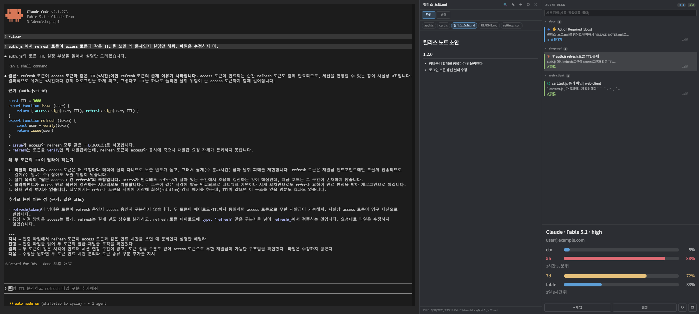

# tabby-agentdeck

**[Website](https://jghwang2.github.io/tabby-agentdeck/) · [User guide](https://jghwang2.github.io/tabby-agentdeck/guide/) · [Full reference](docs/REFERENCE.md) · [한국어](README.ko.md)**

A [Tabby](https://tabby.sh) plugin for people who keep **Claude Code, Codex and Gemini CLI open in several tabs at once**.
A 4:3 terminal, a session deck with live status, and a preview panel for what the agents produce.

## Keys

| Key | What it does |
|---|---|
| `Ctrl+Shift+T` (⌘+T) | New tab in the work root. Replaces Tabby's own new-tab |
| `Ctrl+1` … `Ctrl+9` | Jump to the Nth session in sidebar order |
| `Ctrl+Shift+L` | Focus the session list / same key returns to the terminal. Then `↑↓` walk, `Enter` picks, `Esc` leaves |
| `Ctrl+W` | Close the current tab (the focused row when the list has the keyboard) |
| `Ctrl+Shift+O` | Open / close the preview panel |
| `Ctrl+Shift+U` | Screen repair (same as `↻`) |
| `Ctrl+Shift+Q` | Close the focused split pane |
| `Ctrl+Enter` / `Shift+Enter` | Newline without sending |
| `Ctrl+V` | Paste. An image-only clipboard is handed to the agent as an image |
| Right-click | Copy with a selection, paste without one. Hold for the context menu |
| `Ctrl+F` / `Ctrl+S` | Find / save inside the preview panel |

Two actions ship unbound: `agentdeck-toggle` (sidebar / 4:3 on-off) and `agentdeck-view-mode` (Files ↔ Changes).
Rebind anything under Tabby Settings → Hotkeys → `agentdeck-*`.

## Install

Inside Tabby: Settings → Plugins → search `agentdeck` → Install → restart Tabby.
Everything else — status, groups, preview panel, diff and commit, resuming sessions, settings — is in the
[user guide](https://jghwang2.github.io/tabby-agentdeck/guide/) and the [full reference](docs/REFERENCE.md).

Built and verified on Windows. MIT.
