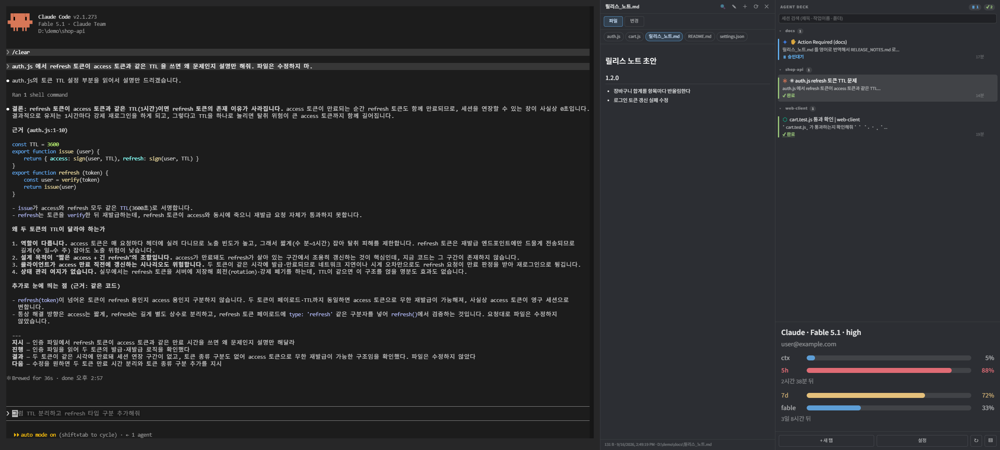

# tabby-agentdeck

**[Website](https://jghwang2.github.io/tabby-agentdeck/) · [User guide](https://jghwang2.github.io/tabby-agentdeck/guide/) · [Full reference](docs/REFERENCE.md) · [한국어](README.ko.md)**

A [Tabby](https://tabby.sh) plugin for people who keep **Claude Code, Codex and Gemini CLI open in several tabs at once**.
A 4:3 terminal, a session deck with live status, and a preview panel for what the agents produce.
Automatic job-related aliases identify agents consistently across tab moves.

## Permanent tab names and cross-session messaging

Keep one agent implementing, another reviewing, and another investigating a bug. Address the target by the alias displayed in your sidebar. The agent resolves that alias from the latest live snapshot to an exact session ID before sending. Aliases vary by user; documentation examples are never actual addresses. A reply or acknowledgement confirms receipt.

- **Keep the original title and show the permanent alias before the status.** Project paths and explicit project labels determine names locally. Unknown projects use their folder names; discovered labels improve future names without renaming existing tabs. Names remain unique, immutable and reserved after closing. Project names and paths are saved in local application settings, never added to the source repository.
- **Letter badges and position numbers are hidden.** `Ctrl+1` … `Ctrl+9` selects the current first through ninth visible tab. Drag tabs to reorder them without changing their names. Messages still use the exact resolved session ID.
- **Delivery and receipt are separate.** Sending queues a message. An acknowledgement or reply confirms that the recipient has read it. An idle agent checks at its next supported hook/task boundary; sending does not automatically start it.

Communication uses AgentDeck's local mailbox through an optional MCP connection or the authenticated CLI fallback. Participating sessions need the supported status hooks and registration; a visible tab alone does not mean messaging is ready. See [setup and supported behavior](https://github.com/jghwang2/tabby-agentdeck/blob/main/docs/SESSION-COMMUNICATION.md).

## Keys

| Key | What it does |
|---|---|
| `Ctrl+T` (⌘+T) | New tab in the work root |
| `Ctrl+1` … `Ctrl+9` | Select the first through ninth currently visible tab |
| `Ctrl+L` | Focus the session list / same key returns to the terminal. Then `↑↓` walk, `Enter` picks, `Esc` leaves |
| `Ctrl+W` | Close the current tab (the focused row when the list has the keyboard) |
| `Ctrl+O` | Open / close the preview panel |
| `Ctrl+R` | Screen repair (same as `↻`). Rename tabs by double-clicking the row |
| `Ctrl+S` | Split side by side (Tabby's own) |
| `Ctrl+D` | Split top / bottom (Tabby's own) |
| `Ctrl+Q` | Close the focused split pane |
| `Ctrl+Enter` / `Shift+Enter` | Newline without sending |
| `Ctrl+V` | Paste. An image-only clipboard is handed to the agent as an image |
| Right-click | Copy with a selection, paste without one. Hold for the context menu |
| `Ctrl+F` / `Ctrl+S` | Find / save inside the preview panel |

Two actions ship unbound: `agentdeck-toggle` (sidebar / 4:3 on-off) and `agentdeck-view-mode` (Files ↔ Changes).
Change any of them under **Settings → AgentDeck → Shortcuts** — a key already used by Tabby or AgentDeck is flagged before it is applied. Tabby Settings → Hotkeys → `agentdeck-*` works too.
These are the defaults for new installs. Existing AgentDeck shortcuts stay as saved; use **Default** beside an action to adopt its new binding. Stock split shortcuts `Ctrl+Shift+S` / `Ctrl+Shift+D` switch to `Ctrl+S` / `Ctrl+D`; custom split bindings are preserved.

## Search past conversations

Expand **Past sessions** and use its search box to find a function name, error code, file name, or session ID. Search matches literal text without case sensitivity in saved Claude/Codex questions and answers. Select a result to preview the matching conversation; **Resume conversation** continues it. The active-tab filter remains separate.

Search runs locally in a background Node.js process, with a disk cache refreshed when transcripts change. Node.js must be available on PATH. It requires no MCP connection or AI request. Tool output and system instructions are excluded. See [history search](docs/HISTORY-SEARCH.md) for scope and storage.

## Install

Inside Tabby: Settings → Plugins → search `agentdeck` → Install → restart Tabby.
Sessions use automatic permanent job aliases beside their original titles. Drag to reorder; numeric shortcuts follow visible order.
The optional [session communication MCP](docs/SESSION-COMMUNICATION.md) sends and receives by actual session ID only. Human numbers never address the MCP server.

Everything else — status, preview panel, diff and commit, resuming sessions, settings — is in the
[user guide](https://jghwang2.github.io/tabby-agentdeck/guide/) and the [full reference](docs/REFERENCE.md).

Built and verified on Windows. MIT.
